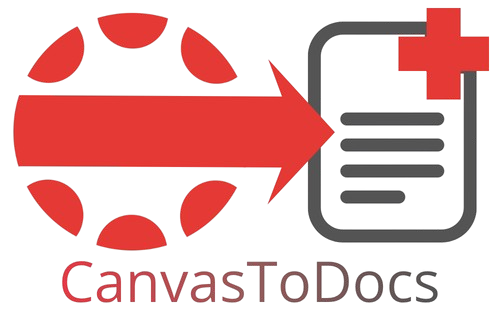

  

# CanvasToDocs 
A simple project for launching and managing Canvas assingments in Google Docs.

## Installation
Head to the [latest release](https://github.com/liamhardman10/CanvasToDocs/releases/tag/v1.0.0), download .zip archive, unzip, unpack folder into chrome://extensions

Soon to be available on the Chrome Web Store.

## Features
- Launch assignment documents with ease
- Names assignments automatically in Docs
- Popup interface
- Plans to implement Slides & Sheets soon.

